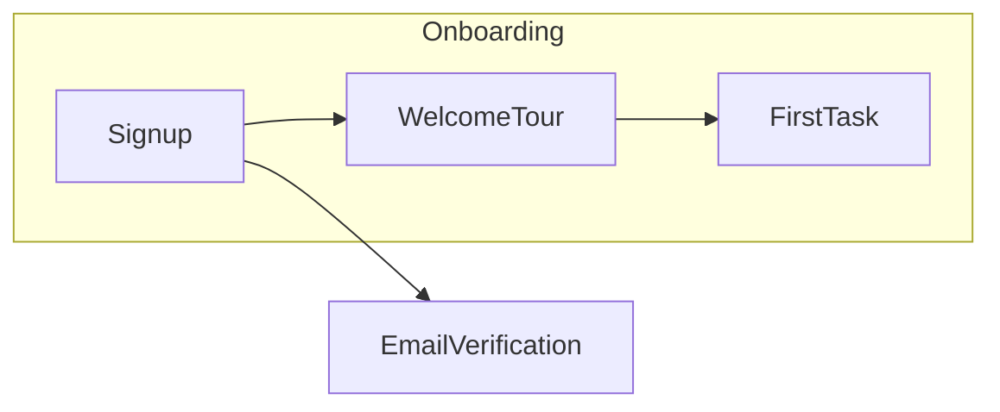

# Markdown-Based Project Management Workflow for Startups (using GitHub)

Project management can be effectively handled *as code* – using Markdown files in a GitHub repository. This approach leverages version control and familiar developer tools to plan, track tasks, and iterate quickly. For startup teams, a Markdown-centric workflow keeps planning lightweight yet structured, accommodating everything from product roadmaps to operations checklists. Below, we outline how to manage projects entirely with Markdown, how collaboration happens via GitHub pull requests, example repository structures and templates, and ways AI agents (like Devin, GPT-4 Codex, and Claude) can assist or automate parts of the process.

## Benefits of Markdown Planning in GitHub for Startups

* **Single Source of Truth in Code:** Keeping project plans and task lists **in the repository** means everyone interacts with the same content as the codebase. This “docs-as-code” approach ensures plans are versioned, reviewed, and updated just like code. It improves transparency and makes it easy to track changes over time (every edit is captured in Git history). For example, writing plans in Markdown lets the team document changes to the plan and even visualize progress (e.g. generating task graphs or completion trends) from the version history.

* **Low Overhead & Familiar Tools:** Startups can avoid complex project management software. Team members likely already have GitHub accounts, so using GitHub itself for planning avoids extra sign-ups or learning new tools. Everyone can contribute via the normal GitHub workflow (pull requests, reviews), lowering the barrier to adoption. This habit-forming convenience is key for small teams – if planning lives alongside code, it’s more likely to be maintained and consulted regularly.

* **Flexibility and Plain-Text Power:** Markdown files are simple and highly flexible. The team can decide their own templates and formats (e.g. checklists, tables, headings) to suit their domain. It’s easy to extend or adjust the format as the project evolves. Unlike rigid tools, a plain-text approach can accommodate product specs, design plans, or ops to-do lists in the same repo. *Distributed backups* come for free (the files are in GitHub) and content is portable – you’re not locked into a proprietary system.

* **Version Control and Accountability:** Managing tasks in Git means every update has an author and timestamp. This provides clear **history and attribution** for decisions. You can review past plans, see why priorities changed (via commit messages or PR discussion), and even measure progress by looking at closed tasks over time. One team noted that treating project management artifacts as code enabled asynchronous updates (fewer meetings) and even measuring progress through Git logs.

> **Note:** While Markdown-in-git is powerful, be aware of its limitations. Non-developers might find it less intuitive to navigate a repo for planning docs. Also, unlike dedicated PM tools, there’s no built-in notification for task due dates or a rich commenting UI for each item. However, using pull requests and review comments (discussed below) can mitigate this by capturing discussions, and the simplicity of a single backlog list can actually aid focus. Some practitioners warn that grouping tasks by themes can conflict with maintaining a single prioritized list; they recommend using one prioritized backlog to avoid fragmentation as the project grows. Startup teams should weigh these trade-offs, but for many, the benefits of simplicity and integration with code outweigh the downsides in early stages.

## Project Planning and Task Tracking with Markdown

Using Markdown files, a startup can manage **project planning, task tracking, and prioritization** without external tools. Key elements of this setup include:

* **Product Roadmap in Markdown:** Create a `ROADMAP.md` at the root of the repo (or in a `/docs` or `/planning` folder). This file outlines the high-level goals, milestones, and features planned for upcoming periods. For example, many projects maintain a public or internal roadmap file that describes how the project should evolve. In the roadmap, you can use Markdown headings for time frames or categories (e.g. `## Q4 2025 Goals`, `## Future Ideas`) and bullet lists or checkboxes for planned features. Each item can have a short description, and if detailed, link to a more specific spec document or task file.

* **Backlog and Task Lists:** Maintain a **backlog** of tasks as a Markdown list. This could be a single `BACKLOG.md` file containing all to-do items, or a directory of individual task files with an index. A simple approach is a prioritized checklist in one file – for example, a `backlog.md` might list features or tasks as bullet points with checkboxes, highest priority at top. Markdown’s task list syntax (`- [ ]` for open tasks, `- [x]` for done) provides a visual status. Nested lists can capture sub-tasks or dependencies. For instance, a backlog might look like:

  ```markdown
  ## Backlog

  - [ ] **Feature:** Implement user sign-up flow (High Priority)  
    - Details: requires UI design and backend API.
  - [ ] **Chore:** Set up CI/CD pipeline (Medium Priority)
  - [ ] **Ops:** Prepare Q3 cloud cost report (Low Priority)
  - [x] **Bugfix:** Resolved payment gateway timeout issue
  ```

  You can also break the backlog into sections (e.g., by category or sprint) using secondary headings. However, ensure the overall order still reflects priority to maintain a *single source of priority truth*. One Markdown planning advocate notes that keeping one prioritized list is essential once a project grows, even if you have to “give up theming” (categorization) to maintain clarity of what comes first.

* **Task/Issue Details in Markdown:** For complex tasks or specs, create individual Markdown files. For example, in a `tasks/` or `specs/` directory, you might have files like `TASK-001-onboarding-flow.md` or `feature_signup_spec.md`. These files can act as lightweight one-pagers or design docs for each significant item. A task Markdown template might include sections such as **Overview**, **Acceptance Criteria**, **Notes/Links**, and **Status**. This is analogous to a detailed ticket description, but stored as a version-controlled doc. By writing specs in Markdown, you ensure they are updated via the same process as code. Team members can propose changes to the spec via PRs as understanding evolves. In the repository’s README or contribution guide, you can reference these task files so newcomers know where to find the current plans.

* **Prioritization and Labels:** Prioritization can be indicated by ordering (top of backlog = highest priority) and by labels or tags in the text. For instance, prefix tasks with tags like **\[P1]** or **(High)** for critical items. Since it’s free-form text, the team should agree on a consistent labeling scheme for priorities (or use sections for “High/Medium/Low Priority”). Additionally, consider capturing due dates or owners in the markdown. This could be as simple as adding *(Due: YYYY-MM-DD)* or *(Owner: @username)* after an item. The format is flexible; what matters is that it’s documented and reviewable. Because the content is plain text, any team member can reorder the list or modify labels in a pull request to reprioritize work (e.g. moving an item higher in the file to reflect increased urgency). The clear diff from the PR will show exactly how priorities changed.

* **Progress Tracking:** As work gets done, tasks are checked off in the Markdown. For example, a developer who completes a task will mark `- [x]` in the backlog or relevant list. Over time, the backlog.md will accumulate checked items (which could be periodically moved to a “Done” section or a separate archive file to keep the main list focused). This provides a quick visual of progress (e.g. 8/10 tasks checked off for the sprint) and, because it’s GitHub Markdown, contributors viewing the file will see checkboxes ticked. Each completed task should ideally reference the code or outcome – for instance, “(PR #42 merged)” or a link to the commit or output, so the plan is linked to execution. With everything in one place, it’s easy for anyone to scan what’s done and what’s upcoming without needing to query multiple tools. *Example:* one project’s **initial backlog** (for a “To-do App” startup) was documented in Markdown, with tasks grouped by feature and checkboxes indicating status. Completed items were checked off, and partially done or blocked tasks were marked with special symbols (`[/]` for in-progress, `[-]` for dropped) – all visible in the Markdown file itself, making the state of the project clear at a glance.

* **Documentation of Decisions:** Because plans are in Markdown, you can use rich formatting to document decisions or context right alongside tasks. For example, in a roadmap item you might include a short rationale or link to a customer issue that prompted it. You can even embed diagrams **inside** Markdown files to illustrate architecture or timelines – GitHub now supports **Mermaid** syntax for diagrams directly in Markdown. This means you could have a section of your spec with a flowchart (written as text in a code block) that automatically renders in the GitHub UI. Keeping such context in the repo ensures that anyone working on the project has the full picture (goals, designs, rationale) version-controlled and accessible.

## Iteration and Collaboration via Pull Requests

Adopting a Markdown-based workflow doesn’t mean losing collaboration – in fact, GitHub’s pull request (PR) mechanism becomes the engine of teamwork. Here’s how iteration happens through PRs:

* **Proposing Changes to Plans:** Any update to a plan or task list is done by submitting a **pull request** with the Markdown changes. For example, if someone wants to adjust the roadmap (add a new feature, change a priority, refine acceptance criteria in a task spec), they create a branch (e.g. `update-roadmap-Q3`) and edit the Markdown files on that branch. The diff might show lines added under Q3 2025 goals, or an item moved higher in the backlog list. Opening a PR lets others review these changes before they become official. This process treats changes to the *plan* with the same rigor as changes to the *code*: nothing changes without peer review and team visibility. It also creates a discussion thread where questions or suggestions about the plan change can be logged. For instance, a teammate might comment, “Should we also include mobile app in this feature scope?” on the PR, leading to an update of the Markdown text.

* **Pull Request Templates for Planning:** It’s useful to have a **pull request template** to guide collaborators on providing necessary info when proposing changes (especially for larger plan docs or design proposals). A PR template can be set up in the repository (e.g. a `.github/PULL_REQUEST_TEMPLATE.md` file) so that every PR description is pre-populated with a format. This template might prompt the contributor to answer:

  * What is the goal or change in this plan update?
  * Which issue/task does it relate to (if using an issue or task ID system)?
  * Checklist: Have impacts on timeline or resources been considered? Are stakeholders aware?
  * etc.

  Using a standardized PR template ensures consistency and clarity. It helps every PR include a clear description and checklist, reducing back-and-forth and setting expectations up front. For example, a simple template could require a short summary of changes, a link to any related task or issue (e.g., “Relates to roadmap item in Q4”), and a checklist like “- \[ ] Team has approved new priority; - \[ ] Documentation updated.” This way, even changes to documentation go through the same quality control as code changes. (As a side benefit, if/when the startup does use issues or links code to plans, this template can remind people to reference them, e.g. “Fixes #123” to close an issue or just a mention of the task ID.)

* **Code and Plan in Sync:** Often, code changes will correspond to tasks in the Markdown plans. Developers can reference the Markdown tasks in their commit messages or PRs for code. For example, a PR implementing a feature might say “Implements Feature X (as per roadmap.md Q3 item)” or even include a snippet of the task for context. Conversely, when closing out a task in the markdown, the PR can be referenced (“Marked Feature X as done – implemented in PR #45”). Though Markdown files don’t have the automatic linking that issues do, these cross-references in text and PR comments help maintain traceability. The PR discussion can serve as a log of decisions/trade-offs for that task, complementing the Markdown spec. In essence, **pull requests become the forum** for discussing both code and plan changes. This encourages a culture where planning is continuous and integrated with development: if a plan needs to change mid-implementation, you open a PR to adjust it, possibly alongside code changes, so the alteration is visible and agreed upon.

* **Review and Iteration:** When a plan update PR is opened, team members (including non-developers given access) can review it. They might suggest edits via GitHub’s review system or just comment their approval. The review process ensures iteration: perhaps the product lead will refine wording or clarify acceptance criteria in a spec during review, or the CTO might question a priority shift and request rationale – all captured in the PR. Only when the team is satisfied is the PR merged, updating the Markdown in the main branch. This models the **iteration via discussion** that usually happens in planning meetings, but asynchronously and with an audit trail. As one engineering blog noted, asynchronous project updates via Git (with all discussions captured in context) can reduce the need for frequent status meetings. Stakeholders can simply read the merged plan or the PR conversation to get context.

* **Merge and Notify:** Once merged, the updated Markdown is immediately the new source of truth. Team members watching the repo can get notifications of changes (e.g. via GitHub’s watch or via chat integrations if set up). Startups often integrate GitHub with Slack or email for notifications – for instance, a Slack message when `ROADMAP.md` changes, prompting everyone to note the new plan. This keeps the entire team in the loop without requiring separate emails or docs – the repository is the hub.

* **Example Workflow:** Imagine a designer wants to add a task for “Revamp Landing Page” in the Q1 roadmap. They create a branch, edit `ROADMAP.md` adding a bullet under Q1 goals, maybe linking to a `design/landing-page-redesign.md` spec. They open a PR titled “Add Landing Page Revamp to Q1 roadmap”. The PR template prompts them to describe why (e.g. “We decided to improve homepage conversion – see customer feedback”). The team lead reviews and asks to clarify scope; the designer updates the spec file accordingly in the same PR. Once approved, the PR is merged. The roadmap now includes that item, and the design spec is in the repo. A developer picking this up later can see the plan in the Markdown and the discussion in the merged PR for context. This tight PR loop on planning changes fosters **collaborative iteration** and ensures consensus.

* **Using Issues/Discussions if Needed:** While Markdown files are the primary medium, teams can still use GitHub Issues or Discussions for extended conversations or to track tasks individually *if* it adds value. For example, a complex task in the markdown backlog might have a corresponding GitHub Issue for detailed discussion or to attach screenshots. You can link the two by noting the issue number in the Markdown. Similarly, discussions can be referenced for broad brainstorming that then gets summarized into the markdown docs. The key is that the Markdown files remain the authoritative list of tasks and plans, and issues/discussions are optional supplements. This hybrid approach can be useful as the startup grows: Issues can feed into the Markdown backlog, but the backlog is what’s prioritized and versioned. (If the team prefers not to use issues at all, that’s fine too – everything can live in the repo as files.)

## Repository Structure and Templates

Organizing your repository for Markdown-based project management is important for clarity. Here’s a recommended **directory structure** and examples of templates:

**Directory Structure:**

```
project-repo/
├── README.md                    # Project overview, goals, and quick links to planning docs
├── ROADMAP.md                   # High-level roadmap and milestones
├── BACKLOG.md                   # Prioritized backlog of tasks (or use /tasks directory)
├── docs/
│   ├── design-system.md         # (Example additional docs)
│   └── ops-checklist.md         # (Example ops or other domain doc)
├── specs/                       # Detailed specifications or design docs
│   ├── feature-x-spec.md        # Specification for Feature X
│   └── launch-plan.md           # e.g., a product launch plan
├── tasks/                       # Individual task or user story files (optional approach)
│   ├── TASK001_onboarding.md
│   └── TASK002_api_rate_limit.md
├── .github/
│   ├── PULL_REQUEST_TEMPLATE.md # Default template for PR descriptions
│   └── ISSUE_TEMPLATE.md        # (If using issue templates for consistency)
└── (source code files and folders)
```

This is just an example – teams should adjust it to their needs. Some teams keep all planning docs in a `/docs` folder or the repository wiki, but storing in the main repository ensures they version-match the code.

**Markdown Template Examples:**

* **Roadmap Template:** A `ROADMAP.md` could use a quarterly or monthly breakdown. For example:

  ```markdown
  # Project Roadmap

  ## Q1 2025 
  - [ ] Launch **v2.0 Beta** (target: March 2025)
    - *Key features:* New onboarding flow, Analytics dashboard.
    - *Success metric:* 1k beta users.
  - [ ] **Hire 2 Support Engineers** (to improve customer response times)

  ## Q2 2025
  - [ ] Scale infrastructure for 100k users
  - [ ] GA release of v2.0 with feedback improvements
  ```

  Each item might eventually link to more detailed docs (e.g., `onboarding-spec.md`). The roadmap should be relatively high-level (epics or major initiatives) and not too granular.

* **Task/Story Template:** For individual tasks or user stories in `tasks/` directory, a Markdown template might look like:

  ```markdown
  # TASK-001: Implement Onboarding Flow

  **Description:** Implement a multi-step user onboarding flow after sign-up, including email verification and welcome tutorial.

  **User Story:** As a new user, I want an onboarding process so I can quickly learn how to use the product.

  **Acceptance Criteria:**
  - [ ] After sign-up, user is directed to an onboarding wizard
  - [ ] Wizard has 3 steps (profile setup, product tour, first task prompt)
  - [ ] Email verification is required before completing step 3
  - [ ] ... (other criteria)

  **Dependencies:** Backend API for user profile must be ready; Design team to provide wizard mockups.

  **Priority:** P2 (High) – Needed for Q1 launch.

  **Status:** *Open* (not started)  
  **Owner:** @johndoe
  ```

  This is essentially a **user story or spec** in Markdown. It captures everything a Jira ticket might contain, but in a lightweight text form. Team members can edit this file via PR if requirements change. When the task is done, this file could be updated with **Status: Done (PR #45)** or simply left as historical record (with the backlog checklist reflecting completion).

* **Spec/Proposal Template:** For bigger design docs or technical specs (e.g. `specs/feature-x-spec.md`), you can use a structure like:

  ```markdown
  # Feature X Technical Design

  **Background & Context:** (Why this feature, links to any previous discussions)

  **Goals:** Bullet list of what we aim to achieve.

  **Non-Goals:** What’s out of scope.

  **Approach:** Explanation of how we plan to implement. Include diagrams (if any), pseudocode, etc.

  **Timeline/Milestones:** If applicable, rough timeline or phases.

  **Impact:** Any impacts on other systems, costs, ops, etc.

  **Open Questions:** Any unresolved issues to decide.
  ```

  This is similar to an internal RFC or PRD (Product Requirement Document), but stored in GitHub. It can be reviewed with PRs and updated as the feature is implemented (or used to track if the implementation deviated from the plan).

* **Pull Request Template:** The `.github/PULL_REQUEST_TEMPLATE.md` ensures that every PR (whether it’s a code change or a plan doc change) has a standard structure. An example template might be:

  ```markdown
  ## Describe your changes
  *Provide a brief summary of the changes in this PR (what and why).* 

  ## Related Issue/Ticket
  *If this PR addresses or closes a task, link it here.* 
  e.g., "Closes TASK-001" or "Updates ROADMAP Q1 item"

  ## Checklist for submitter
  - [ ] Self-reviewed code/documentation
  - [ ] Added/updated relevant docs (if needed)
  - [ ] If this is a major change, team has been notified (Slack/email)

  ## Checklist for reviewers
  - [ ] Plan changes make sense and align with overall goals
  - [ ] No critical points missed (check acceptance criteria, etc.)
  ```

  This template is adapted to a documentation+code workflow. It reminds contributors to update docs when they change code and reminds reviewers to consider plan impact. As noted, having such checklists and guidelines in each PR improves consistency and clarity. It’s especially useful in a startup where contributors wear many hats; the template serves as a gentle guardrail to not forget important steps (like updating a relevant Markdown task or notifying someone).

**Tip:** Use relative links in your Markdown files to connect them. For example, in a roadmap item you can link to `tasks/TASK-002_onboarding.md` for details. This helps navigation. Also, consider adding a **table of contents** in long docs (GitHub can often render a TOC via headings, or you can manually add one) so readers can jump to sections easily.

Finally, remember that **diagrams and tables** can be included in Markdown to enhance clarity. GitHub’s support for Mermaid diagrams means you can keep architecture diagrams in sync with the written plan. For instance, in a spec you might have:

````markdown


This would render a flowchart for the onboarding process directly in the GitHub view of the Markdown. Such integrations keep all planning artifacts in one place, tightly coupled to the text.

## Using AI Agents to Enhance the Workflow

Leveraging AI can make a Markdown-based workflow even more powerful. AI agents like **Devin, GPT-4 Codex, and Claude** can support or automate various aspects of project management:

- **Drafting Plans and Documents:** Large language models (LLMs) can generate initial drafts for roadmaps, task breakdowns, or design specs. For example, you could prompt GPT-4 (or ChatGPT powered by GPT-4 Codex for code-oriented prompts) with a description of a product idea, and ask it to produce a structured feature roadmap in Markdown. The AI might output a list of features, each with some details, which you can then refine. This accelerates the planning phase by providing a starting point. Similarly, for a given feature request, an AI can draft a user story or spec document (following your template) that you then edit for accuracy. Since GPT-4 and similar models have been trained on a lot of project documentation, they often know to include sections like “Background, Approach, etc.” (Of course, humans should validate and adjust the output, but it saves time on blank-page syndrome.)

- **Breaking Down Tasks:** AI can help decompose big goals into actionable tasks. Anthropic’s **Claude** model, for instance, is particularly good at understanding context and producing structured plans. Claude 4 has been shown to turn a *vague project goal into a step-by-step blueprint with milestones and realistic deadlines*:contentReference[oaicite:23]{index=23}. You could give Claude a high-level goal (e.g. “Launch a new marketing campaign”) and it can suggest a breakdown: task list, timeline, and priority of each step. This can feed directly into your Markdown backlog or roadmap. In fact, one article notes Claude can apply frameworks like the Eisenhower Matrix to prioritize tasks by urgency and importance:contentReference[oaicite:24]{index=24} – you might input a list of tasks and ask it to label which are high priority vs can be deferred. Using such output, a startup team can systematically manage priorities, with the AI ensuring nothing critical is overlooked in planning. These suggestions can then be reviewed and merged into the official plan. Essentially, AI can act as a **planning co-pilot**, generating draft plans which the team curates.

- **Automating Reviews and Quality Checks:** AI coding assistants (like **GitHub Copilot**, powered by Codex, or review bots) can be integrated into the PR workflow. For example, an AI could be set up to comment on pull requests that contain Markdown changes, offering feedback. A tool like **PR-Agent** or similar AI PR reviewer can analyze the diff and point out if something is unclear or if a checklist item wasn’t addressed:contentReference[oaicite:25]{index=25}. Suppose a contributor submits a PR updating a spec; an AI could automatically check that the spec includes acceptance criteria or that the new task has an owner assigned, etc., based on your predefined rules. These AI feedback loops act as an automated project manager assistant, catching omissions and maintaining consistency.

- **Content Summarization and Search:** As your Markdown plans grow, AI can help summarize or extract information. Team members might use chat interfaces (e.g. a Slack bot backed by GPT-4 or Claude) that can answer questions about the project documentation. For instance, “@AIbot what are our Q1 2025 priorities?” could prompt the bot to read `ROADMAP.md` and summarize the Q1 section. Because the docs are plain text, hooking an AI to them is straightforward – you could script something to feed the markdown content to an API. This is powerful for onboarding new team members (they can ask natural language questions about the plans) or for busy founders to quickly get status updates (“How many tasks are marked done in backlog.md?”). In effect, the AI acts like an **interactive lens** over your documentation, which is useful if the startup is moving fast and not everyone has time to read every document in full detail daily.

- **Priority Management and Scheduling:** Beyond static plans, AI can assist in dynamic prioritization. Using the data in your backlog (due dates, estimates, priorities), an AI could help adjust the schedule. For example, if some deadlines slip, you might ask the AI to suggest a revised timeline. Tools or prompts can be designed for this: *“Given the tasks and their statuses, what should we focus on this week?”* The AI might analyze the open tasks and propose the top 3 priorities, referencing the urgency/importance (Claude is noted to do this kind of reasoning, sorting tasks by what deserves attention now:contentReference[oaicite:26]{index=26}). This can augment the role of a project lead by providing a second opinion on what’s next. For personal productivity, AI can even help individuals plan their day based on the task list (as seen in some Claude examples where it helps build daily schedules:contentReference[oaicite:27]{index=27}, though that’s more on the personal side).

- **Autonomous Task Execution:** In some cutting-edge cases, AI agents like **Devin** (by Cognition) aim to not only plan but also execute tasks. Devin is described as an *“autonomous AI software engineer”* that can take on complex tasks, writing code, testing it, and even creating pull requests for the changes:contentReference[oaicite:28]{index=28}. In the context of project management, this means if you have well-defined tasks in your Markdown backlog, an AI like Devin could potentially pick one and attempt to implement it. For example, if “Add forgot password feature” is a task, Devin could generate the code for it and open a PR. Devin’s approach is an asynchronous, hands-free coding solution where entire tasks (new features, bug fixes) are offloaded to the AI, which then produces a PR for human review:contentReference[oaicite:29]{index=29}. For a startup, this could dramatically speed up execution of routine tasks – the AI works in parallel on well-scoped items while the human team focuses on critical or creative work. While this is still emerging technology (and one would use it carefully, reviewing all AI contributions), it showcases how AI agents integrate with the Markdown workflow: the backlog entry leads to an AI-driven PR, which team members then review just like any other contribution. Even if fully autonomous coding isn’t used, intermediate steps are helpful – e.g., using GPT-4/Codex via Copilot to generate snippets of code or configuration as you implement tasks, or using AI to draft test cases once a spec is written. All these agents act like **assistants embedded in the development workflow**, reducing manual overhead.

- **AI for Documentation Updates:** Another use-case is ensuring documentation stays up-to-date. Let’s say code changes in a PR – an AI could be employed to check if corresponding docs (maybe a snippet in a README or a spec) need updating. Some advanced setups might have a GitHub Action that runs an LLM to read a diff and the relevant docs and either flag inconsistencies or even propose a doc change. This kind of automation helps maintain the integrity of the Markdown plans relative to reality. It’s like having a bot ask “You changed the API, should we update the API spec file too?” in the PR. This keeps the repository’s documentation “alive” and accurate, which is crucial when using it as the main project management tool.

In summary, AI agents contribute by **speeding up writing**, ensuring **quality and consistency**, and even **automating execution** of tasks. A practical approach for a startup is to start by using AI informally – e.g., ask ChatGPT to outline a project plan, use Copilot when editing Markdown for suggestions – and gradually integrate more automated tools (like PR assistants or even autonomous agents) as the value becomes clear. The result is a semi-automated project management system where humans and AI collaborate: humans provide vision and validation, AI provides drafts, analysis, and labor.

## Adapting to Startup Team Needs (Engineering, Design, Ops, etc.)

One of the strengths of a Markdown+GitHub workflow is its adaptability across different functions of a startup. Because the system is essentially just text files and Git processes, **various team roles can all use it in ways that suit them**, creating a unified project space:

- **Engineering / Product Development:** This is the most straightforward application – developers manage feature roadmaps, sprint backlogs, and technical specs in Markdown. They link tasks to code and use PRs to discuss implementations. It’s essentially an agile process without Jira: the backlog.md replaces a typical backlog board. Startups building software can benefit greatly from this lightweight approach, as it keeps engineers focused in their IDE/GitHub environment. Code and documentation live together, so features are always implemented with reference to the plan. For example, an engineer picking up a task can open `tasks/FEATURE-xyz.md` and find the acceptance criteria and design notes right there, then check off the item when done.

- **Design and UX:** Designers can contribute by adding design-specific tasks and documents. A `design/` folder might contain Markdown docs for things like a **Design System roadmap**, a **UX research plan**, or meeting notes. Designers could outline their workflow (e.g., “Create high-fidelity mockups for onboarding screens”) as tasks in the backlog as well, ensuring design work is visible alongside development tasks. They can attach links to Figma or images in the Markdown for visual context. Design reviews could even happen via PR: a designer posts a link to new mockups in a Markdown file and opens a PR; teammates comment with feedback on that file. Alternatively, if a design uses an image, the image can be embedded in the Markdown (by adding it to the repo or linking) so the PR diff itself shows the old vs new image. This way, even non-code work benefits from versioned discussion. By treating design plans as Markdown, the design team’s progress and blockers become part of the same project timeline.

- **Operations / Admin:** Operational checklists and processes can be kept in the repository too. For instance, an Ops manager could maintain a `ops-checklist.md` for recurring tasks (month-end accounting, server maintenance steps, etc.). When a recurring task is done, they might tick it off or update a date. If the startup is running experiments or OKRs, those could be tracked in Markdown files (e.g., `OKRs_2025.md` listing objectives and key results with checkboxes updating progress). Even HR or hiring plans could be simple Markdown tables or lists in an “Operations” section of the repo. Since GitHub can render tables, you might have a table of prospective hires or vendor comparisons in a Markdown doc. This keeps such information accessible to the core team without needing separate Google Docs or similar. Of course, sensitive info might not belong in a public repo, but for private repos this is an option. The key is that all these different threads (engineering, design, ops) can be tracked uniformly. A weekly review meeting at the startup could literally involve opening the repo and reading from the roadmap and backlog files to see status across the board.

- **Cross-Functional Collaboration:** Because everyone is using the same system, it encourages cross-functional input. A marketer could add a task in the backlog for “Plan launch event”, and an engineer seeing it can be aware of that timeline. Or an engineer could leave a comment in a design spec PR about technical feasibility. GitHub’s mentions (@username) work in comments on PRs and even in commit messages, so you can tag the relevant person (designer, product manager, etc.) to get their input on a plan change. This breaks down silos that sometimes form when each team uses separate tools (e.g., devs in Jira, designers in Trello, etc.). In a startup, keeping everyone on the same page is vital – literally having one page (or one repo) of truth helps. 

- **Scale and Evolution:** As the startup grows, this Markdown approach can evolve. You might start with everything in one repository. Eventually, if there’s a need, you could split docs into multiple repos or integrate with more sophisticated tools. But even then, the skills developed (writing clear Markdown docs, disciplined use of GitHub PRs for changes, linking code to plans) remain extremely useful. Many larger projects still use `ROADMAP.md` or `CHANGELOG.md` for transparency:contentReference[oaicite:30]{index=30}. And if the team later adopts a tool like GitHub Issues or Projects, they can do so gradually – perhaps treating each Markdown task as an issue to get better tracking, while still writing details in the Markdown (just linking the two). The Markdown files could even be used to auto-generate issues via scripts if needed. Thus, the system is flexible: it’s a great fit for small teams now, and it doesn’t paint you into a corner for later.

## Examples of Tools and Projects Embracing Markdown Workflows

To reinforce the concepts, here are a few examples of tools or projects that use similar Markdown-centric approaches:

- **Markdown Planning Syntax (Open Source):** The repository **“markdown-plan”** provides a simple syntax and tooling for writing plans in Markdown:contentReference[oaicite:31]{index=31}:contentReference[oaicite:32]{index=32}. It highlights benefits like visualizing plans (e.g., generating a dependency DAG from a Markdown list) and tracking progress over time via version control. This might be useful if you want a lightweight script to parse your Markdown tasks and maybe output a chart or progress report. It’s essentially a confirmation that others find writing plans as plain lists in text effective.

- **Backlog.md Pattern:** Some developers have shared their experience using a single `backlog.md` file for project management. In one discussion, a contributor describes a “bullet journaling in git” approach, which yielded a *“crisp prioritized list with story state, easy reprioritization, clear history, and flexible format”*:contentReference[oaicite:33]{index=33}. The *StoryTime* forum example we saw showed how a basic backlog file in a repo can serve as the project’s task list, and noted that it covers most needs for small projects without specialized tools. This reflects real-world usage: many devs simply maintain a to-do list in the repo and find it surprisingly effective.

- **Kanban Board from Markdown – Tasks.md:** An interesting tool, **Tasks.md**:contentReference[oaicite:34]{index=34}, demonstrates how Markdown files can even drive a visual task board. It’s a self-hosted app where each “card” on the board corresponds to a markdown file (representing a task) in a git repository. The lanes and tags for the cards are also controlled via the content or file structure. Essentially, it reads the markdown content and presents a Trello-like interface on top of it. This is a great example of extending the Markdown approach with a UI: your data remains simple files, but people who like drag-and-drop can use the web UI which then just edits the files behind the scenes. While you may not need this for all projects, it shows that if down the line the team wants a more visual interface, it’s possible to build on the markdown foundation (or integrate with existing services) without abandoning the simplicity of the underlying format.

- **GitHub README/Roadmap Conventions:** Many open-source projects use markdown files for project planning. For instance, they include a `ROADMAP.md` or `VISION.md` to outline upcoming features, as mentioned earlier. Some also use the main `README.md` to call out major pending features or to maintain a task list of high-level goals. One open-source example is the container runtime *containerd*, which in its docs noted that they prefer issues for dynamic tracking, but they acknowledged that `ROADMAP.md` files are a common way to communicate project direction:contentReference[oaicite:35]{index=35}. Another example is the **Dovyski/template** project, which includes a ROADMAP.md to illustrate how the project should evolve:contentReference[oaicite:36]{index=36} – demonstrating that even project templates encourage roadmap files. These examples reinforce that markdown roadmaps/backlogs are not an unusual practice.

- **Docs as Code in Industry:** The “docs as code” movement (common in technical writing circles) often cites storing documentation in version control (GitHub) and using the same processes as development:contentReference[oaicite:37]{index=37}. Our approach is a specific case of docs-as-code for project management. Companies like Pinterest (with PDocs) and others have adopted similar approaches for maintaining documentation and planning artifacts in git for consistency:contentReference[oaicite:38]{index=38}. So, while our focus is startups, the idea scales – it’s used in enterprises to reduce delays and keep docs close to development:contentReference[oaicite:39]{index=39}.

- **AI Integration Examples:** On the AI side, projects like **OpenDevin** (open-source attempt at Devin) and various GitHub apps (like the PR assistants mentioned) are emerging. For example, **PR-Agent** by Qodo AI analyzes PRs to give automated feedback:contentReference[oaicite:40]{index=40}, and **pr-buddy** helps automate writing PR descriptions:contentReference[oaicite:41]{index=41}. These indicate a trend of AI tools slotting into the GitHub workflow. While still early, a startup could experiment with such tools to handle some of the grunt work (like ensuring every PR description follows the template, or summarizing what a big PR does in plain English for the team). On the planning side, no specific public tool may yet perfectly integrate GPT-4 or Claude into Markdown planning, but it's straightforward to script (for instance, a GitHub Action that runs on new commits to `ROADMAP.md` and posts a summary or key highlights to Slack, powered by GPT). The pieces are all there for those who want to push automation further.

---

**Conclusion:** A markdown-based project management workflow in GitHub offers startups a *lightweight, developer-friendly* way to keep plans and execution tightly aligned. By managing roadmaps, tasks, and priorities as markdown files in a repo, startups gain version control, transparency, and flexibility – all while avoiding tool overload. Collaboration via pull requests brings iterative improvement to plans, just as it does to code, and ensures team buy-in on changes. With the rise of AI assistants, even more of the planning and coordination burden can be automated or augmented – from drafting documents to reviewing changes and even coding tasks autonomously. This approach is not only viable for software development but extends to all parts of a startup’s operations, creating a unified, text-driven source of truth. It’s an approach rooted in the “keep it simple” philosophy: using plain text and GitHub’s robust collaboration features to manage complex projects in a nimble way. As your startup grows, this workflow can grow with you – and you’ll have a rich history of every decision and task at your fingertips, documented in Markdown.

**Sources:** The ideas above draw on a variety of inspirations and real-world practices. For instance, writing plans in Markdown has known benefits like better transparency and tracking:contentReference[oaicite:42]{index=42}. The example backlog format and its pros/cons come from discussions by developers who prefer a `backlog.md` in their repo:contentReference[oaicite:43]{index=43}:contentReference[oaicite:44]{index=44}, as well as open-source templates that use roadmap files:contentReference[oaicite:45]{index=45}. The advantages of treating project management “as code” (e.g. asynchronous updates, measuring progress via git) have been observed in engineering blogs:contentReference[oaicite:46]{index=46}. Pull request templates are recommended to standardize collaboration:contentReference[oaicite:47]{index=47}. On AI, capabilities of tools like Devin and Copilot are documented – Devin can autonomously handle tasks and even open PRs:contentReference[oaicite:48]{index=48}, and LLMs like Claude are noted for turning goals into detailed plans with deadlines:contentReference[oaicite:49]{index=49} and helping prioritize work:contentReference[oaicite:50]{index=50}. These sources and tools underscore the feasibility and benefits of the described workflow, showing that while the approach is modern, it builds on proven concepts.

```
